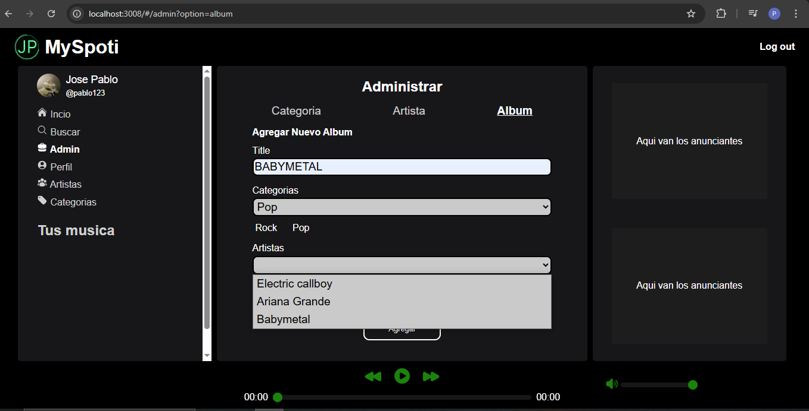

# Client part

## Technologies

- **Languages:** Javascript, SASS, Typescript, HTML
- **Frameworks and Libreries:** React, react-router-dom, react-reduct, @reduxjs/toolkit.
- **Build tool:** Vite
- **Environment development:** Nodejs(v22.12.0)

## Screenshots

### Login

### Sign up

### Admin: Create Category

### Admin: Create Artists

### Admin: Create Album

### Admin: Create Songs

#### Default form

#### Form with some update songs

### Home page

### Search page

#### Part 1

#### Part 2

### Category Page

### Artist Page

### One Artist page

### One Category page

### Album page

### No admin user view

