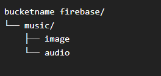

# Service

## Technologies

- **Language:** Java
- **Framework:** Spring boot
- **Key libraries:** Spring secuirty, Spring web, JWT, Firebase Admin, JPA
- **Database:** [Cloud Firestore (Firebase)](https://firebase.google.com/ "Cloud Firestore (Firebase)") , Postgresql
- **Development environment**: Openjdk-21 (provided by windows)

## Databse Schema

### Postgresql diagram
[](../diagrams/tables.dbml "tables")


### Firebase paths in storage


## HTTP Requests

Base routes for http requests


`<http | https>://<host>/api/**`

All endpoints that return lists support pagination using the `Pageable` interface  therefore you the option to include the following queries:

`?size={number}&page={number}`

## Index


- [Login](#login)
- [Sign up](#sign-up)
- [View is admin](#view-is-admin)
- [Update profile picture](#update-profile-picture)
- [View user information](#view-user-information)
- [Update Category](#update-category)
- [Update Artist](#update-artist)
- [Update Album](#update-album)
- [Update Song](#update-song)
- [Delete Requests](#delete-requests)
- [Categories](#categories)
- [Find categories lists for home](#find-categories-lists-for-home)
- [Categories by different ids](#categories-by-different-ids)
- [Category by id](#category-by-id)
- [Artist by id](#artist-by-id)
- [Artist by different ids](#artist-by-different-ids)
- [Album list](#album-list)
- [Album by id](#album-by-id)
- [Album list by ids](#album-list-by-ids)
- [Song by id](#song-by-id)
- [Random song list](#random-song-list)
- [Song list by album id](#song-list-by-album-id)


### Login

```http
POST /user/login
```

#### Role

- Not required

#### Headers

```json
{
  "Content-Type": "application/json"
}
```

#### Body

```json
{
	"username":"string",
	"password":"string"
}
```

#### Response

```json
{
	"jwt": "string"
}
```

### Sign up

```http
POST /user/register
```

#### Role

- Not required

#### Headers

```json
{
  "Content-Type": "application/json"
}
```

#### Body

```json
{
"username":"string",
"password":"string",
"nickname":"string"
}
```

#### Response

```json
{
  "jwt": "string"
}
```

### View is admin

```http
GET /user/viewadmin
```

#### ROLE

- USER

#### Headers

```json
{
  "Authorization": "Bearer {jwt}"
}
```

#### Response

```json
{
  "viewAdmin": "boolean"
}
```

### Update profile picture

```http
POST /user/addimageprefile
```

#### Role

- User

#### Headers

```json
{
  "Authorization": "Bearer {jwt}"
}
```

#### Body

This is not a json request, you need a multipart request, in `Javascript` you could use `new FormData()`.

| title | type    |
|-------|---------|
| image | image/* |

#### Response

```json
{
  "username": "string",
  "nickname": "string",
  "urlImage": "string"
}
```

### View user information

```http
POST /user/viewuserinfo
```

#### Role

- User

#### Headers

```json
{
  "Authorization": "Bearer {jwt}"
}
```


#### Response

```json
{
  "username": "string",
  "nickname": "string",
  "urlImage": "string"
}
```

### Update Category

```http
POST /category
```

#### Role

- Admin

#### Headers

```json
{
  "Authorization": "Bearer {jwt}"
}
```

#### Body

Multipart file

| title | type    |
|------|---------|
| image | image/* |
|title|string|

#### Response

```json
{
  "id": "number",
  "title": "string",
  "urlImage": "string"
}
```

### Update Artist

```http
POST /artist
```

#### Role

- Admin

#### Headers

```json
{
  "Authorization": "Bearer {jwt}"
}
```

#### Body

Multipart file

| title | type    |
|-------|---------|
| image | image/* |
| name  |string|

#### Response

```json
{
  "id": "number",
  "name": "string",
  "urlImage": "string"
}
```

### Update Album

```http
POST /album
```

#### Role

- Admin

#### Headers

```json
{
  "Authorization": "Bearer {jwt}"
}
```

#### Body

Multipart file

| title | type               |
|------|--------------------|
| image | image/*            |
|title| string             |
|categorylist| [id_categories...] |
|artistlist| [id_artists...]    |

#### Response

```json
{
  "id": "number",
  "title": "string",
  "urlImage": "string",
  "artists": [
    {
      "id": "number",
      "name": "string",
      "urlImage": "string"
    }
  ],
  "categories": [
    {
      "id": "number",
      "title": "string",
      "urlImage": "string"
    }
  ]
}
```

### Update Song

```http
POST /album/song/{id_album}
```

#### Role

- Admin

#### Headers

```json
{
  "Authorization": "Bearer {jwt}"
}
```

#### Body

Multipart file

| title | type                              |
|-------|-----------------------------------|
| audio | .mp3, .wav, audio/mpeg, audio/wav |
| title | string |

#### Response

```json
{
  "id": "number",
  "title": "string",
  "urlImage": "string",
  "urlAudio": "string",
  "album": {
    "id": "number",
    "title": "string",
    "urlImage": "string",
    "artists": [
      {
        "id": "number",
        "name": "string",
        "urlImage": "string"
      }
    ],
    "categories": [
      {
        "id": "number",
        "title": "string",
        "urlImage": "string"
      }
    ]
  }
}
```

### Delete Requests

#### Delete Artists

```
DELETE /artist/{id_artist}
```

#### Delete Category

```
DELETE /category/{id_category}
```

#### Delete Album

```
DELETE /album/{id_album}
```

#### Delete song

```
DELETE /album/song/{id_song}
```

#### Role

- Admin

#### Headers

```json
{
  "Authorization": "Bearer {jwt}"
}
```

#### Body

- No content (Status code: 204)

### Categories

```http
GET /category
```

#### Roles

- User

#### Headers

```json
{
  "Authorization": "Bearer {jwt}"
}
```

#### Response

```json
[
  {
    "id": "number", 
    "title": "string", 
    "urlImage": "string"
  }
]
```

### Find categories lists for home

This request retrieves some categories with at least 5 albums in each one.

```HTTP
GET /category/album/list
```

#### Roles

- User

#### Headers

```json
{
  "Authorization": "Bearer {jwt}"
}
```

#### Response

```json
[
  {
    "id":"number",
    "title": "string",
    "urlImage": "string",
    "albums": [
      {
        "id": "number",
        "title": "string",
        "urlImage": "string"
      }
    ]
  }
]
```

### Categories by different ids

#### Category by album id

```http
GET /category/album/{id_album}
```

#### Category by artist id

```http
GET /category/artist/{id_artist}
```

#### Roles

- User

#### Headers

```json
{
  "Authorization": "Bearer {jwt}"
}
```

#### Response

```json
[
  {
    "id": "number", 
    "title": "string", 
    "urlImage": "string"
  }
]
```

### Category by id

```http
GET /category/{id}
```

#### Roles

- User

#### Headers

```json
{
  "Authorization": "Bearer {jwt}"
}
```

#### Response

```json

{
  "id": "number", 
  "title": "string", 
  "urlImage": "string"
}

```

### Artist by id


```HTTP
GET /artist/{id_artist}
```

#### Roles

- User

#### Headers

```json
{
  "Authorization": "Bearer {jwt}"
}
```

#### Response

```json
[
  {
    "id": "number", 
    "name": "string", 
    "urlImage": "string"
  }
]
```

### Artist by different ids


#### By id album

```HTTP
GET /artist/album/{id album}
```

#### By id category

```HTTP
GET /artist/category/{id_category}
```

#### Roles

- User

#### Headers

```json
{
  "Authorization": "Bearer {jwt}"
}
```

#### Response

```json
[
  {
    "id": "number", 
    "name": "string", 
    "urlImage": "string"
  }
]
```

### Album list

```HTTP
GET /album
```

#### Roles

- User

#### Headers

```json
{
  "Authorization": "Bearer {jwt}"
}
```

#### Response

```json
[
  {
    "id": "number",
    "title": "string",
    "urlImage": "string",
    "artists": [
      {
        "id": "number",
        "name": "string",
        "urlImage": "string"
      }
    ],
    "categories": [
      {
        "id": "number",
        "title": "string",
        "urlImage": "string"
      }
    ]
  }
]
```

### Album by id

```HTTP
GET /album
```

#### Roles

- User

#### Headers

```json
{
  "Authorization": "Bearer {jwt}"
}
```

#### Response

```json

{
  "id": "number", 
  "title": "string", 
  "urlImage": "string", 
  "artists": [
    {
      "id": "number", 
      "name": "string", 
      "urlImage": "string"
    }
  ], 
  "categories": [
    {
      "id": "number", 
      "title": "string", 
      "urlImage": "string"
    }
  ]
}
```

### Album list by ids

#### By category id

```HTTP
GET /album/category/{id_category}
```

#### By artist id

```HTTP
GET /album/artist/{id_artist}
```

#### Roles

- User

#### Headers

```json
{
  "Authorization": "Bearer {jwt}"
}
```

#### Response

```json
[
  {
    "id": "number",
    "title": "string",
    "urlImage": "string",
    "artists": [
      {
        "id": "number",
        "name": "string",
        "urlImage": "string"
      }
    ],
    "categories": [
      {
        "id": "number",
        "title": "string",
        "urlImage": "string"
      }
    ]
  }
]
```

### Song by id

```http
GET /album/song/onesong/{id_song}
```

#### Roles

- User

#### Headers

```json
{
  "Authorization": "Bearer {jwt}"
}
```

#### Response

```json
{
  "id": "number",
  "title": "string",
  "urlImage": "string",
  "urlAudio": "string",
  "album": {
    "id": "number",
    "title": "string",
    "urlImage": "string",
    "artists": [
      {
        "id": "number",
        "name": "string",
        "urlImage": "string"
      }
    ],
    "categories": [
      {
        "id": "number",
        "title": "string",
        "urlImage": "string"
      }
    ]
  }
}
```

### Random song list

This request does not have `Pageable` interface and returns 8 songs randomly.

```http
GET /album/song/random
```

#### Roles

- User

#### Headers

```json
{
  "Authorization": "Bearer {jwt}"
}
```

#### Response

```json
{
  "id": "number",
  "title": "string",
  "urlImage": "string",
  "urlAudio": "string",
  "album": {
    "id": "number",
    "title": "string",
    "urlImage": "string",
    "artists": [
      {
        "id": "number",
        "name": "string",
        "urlImage": "string"
      }
    ],
    "categories": [
      {
        "id": "number",
        "title": "string",
        "urlImage": "string"
      }
    ]
  }
}
```

### Song list by album id

This request does not have `Pageable` interface and returns 8 songs randomly.

```http
GET /album/song/{id_album}
```

#### Roles

- User

#### Headers

```json
{
  "Authorization": "Bearer {jwt}"
}
```

#### Response

```json
[
  {
    "id": "number",
    "title": "string",
    "urlImage": "string",
    "urlAudio": "string",
    "album": {
      "id": "number",
      "title": "string",
      "urlImage": "string",
      "artists": [
        {
          "id": "number",
          "name": "string",
         "urlImage": "string"
        }
      ],
     "categories": [
        {
          "id": "number",
          "title": "string",
          "urlImage": "string"
        }
      ]
    }
  }
]
```