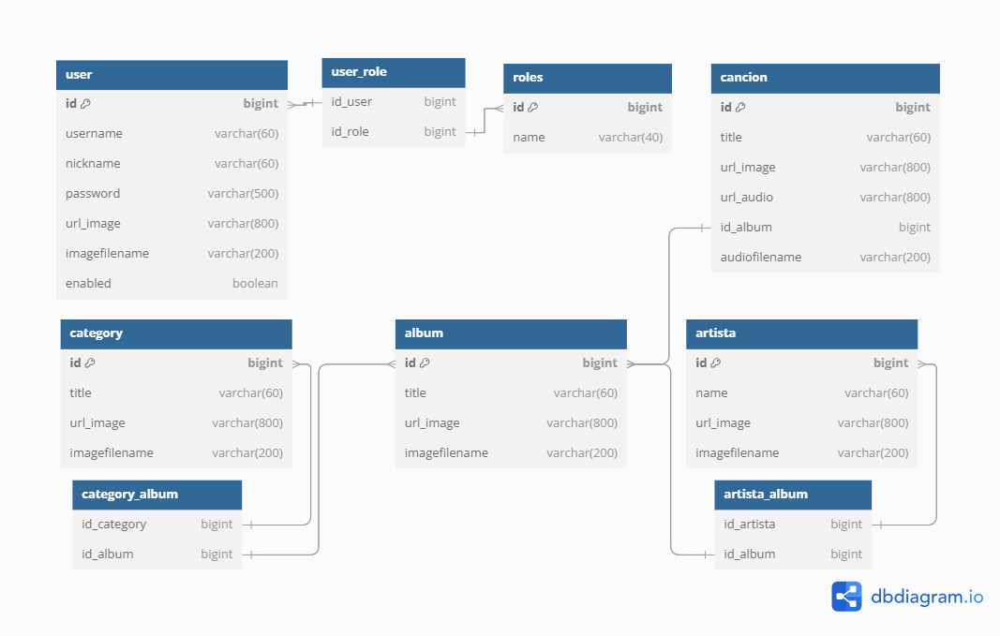

# Service

## Databse Schema

[](../diagrams/schema.png "tables")

## HTTP Requests

Base routes for http requests


`<http | https>://<host>/api/**`

### Login

```http
POST /user/login
```

#### Role

- Not required

#### Headers

```json
{
  "Content-Type": "application/json"
}
```

#### Body

```json
{
	"username":"string",
	"password":"string"
}
```

#### Response

```json
{
	"jwt": "string"
}
```

### Sign up

```http
POST /user/register
```

#### Role

- Not required

#### Headers

```json
{
  "Content-Type": "application/json"
}
```

#### Body

```json
{
"username":"string",
"password":"string",
"nickname":"string"
}
```

#### Response

```json
{
  "jwt": "string"
}
```

### View is admin

```http
GET /user/viewadmin
```

#### ROLE

- USER

#### Headers

```json
{
  "Authorization": "Bearer {jwt}"
}
```

#### Response

```json
{
  "viewAdmin": "boolean"
}
```

### Update profile picture

```http
POST /user/addimageprefile
```

#### Role

- User

#### Headers

```json
{
  "Authorization": "Bearer {jwt}"
}
```

#### Body

This is not a json request, you need a multipart request, in `Javascript` you could use `new FormData()`.

| title | type    |
|-------|---------|
| image | image/* |

#### Response

```json
{
  "username": "string",
  "nickname": "string",
  "urlImage": "string"
}
```

### View user information

```http
POST /user/viewuserinfo
```

#### Role

- User

#### Headers

```json
{
  "Authorization": "Bearer {jwt}"
}
```


#### Response

```json
{
  "username": "string",
  "nickname": "string",
  "urlImage": "string"
}
```

### Update Category

```http
POST /category
```

#### Role

- Admin

#### Headers

```json
{
  "Authorization": "Bearer {jwt}"
}
```

#### Body

Multipart file

| title | type    |
|------|---------|
| image | image/* |
|title|string|

#### Response

```json
{
  "id": "number",
  "title": "string",
  "urlImage": "string"
}
```

### Update Artist

```http
POST /artist
```

#### Role

- Admin

#### Headers

```json
{
  "Authorization": "Bearer {jwt}"
}
```

#### Body

Multipart file

| title | type    |
|-------|---------|
| image | image/* |
| name  |string|

#### Response

```json
{
  "id": "number",
  "name": "string",
  "urlImage": "string"
}
```

### Update Album

```http
POST /album
```

#### Role

- Admin

#### Headers

```json
{
  "Authorization": "Bearer {jwt}"
}
```

#### Body

Multipart file

| title | type               |
|------|--------------------|
| image | image/*            |
|title| string             |
|categorylist| [id_categories...] |
|artistlist| [id_artists...]    |

#### Response

```json
{
  "id": "number",
  "title": "string",
  "urlImage": "string",
  "artists": [
    {
      "id": "number",
      "name": "string",
      "urlImage": "string"
    }
  ],
  "categories": [
    {
      "id": "number",
      "title": "string",
      "urlImage": "string"
    }
  ]
}
```

### Update Song

```http
POST /album/song/{id_album}
```

#### Role

- Admin

#### Headers

```json
{
  "Authorization": "Bearer {jwt}"
}
```

#### Body

Multipart file

| title | type               |
|-------|--------------------|
| audio | .mp3, .wav, audio/mpeg, audio/wav|           |

#### Response

```json
{
  "id": "number",
  "title": "string",
  "urlImage": "string",
  "urlAudio": "string",
  "album": {
    "id": "number",
    "title": "string",
    "urlImage": "string",
    "artists": [
      {
        "id": "number",
        "name": "string",
        "urlImage": "string"
      }
    ],
    "categories": [
      {
        "id": "number",
        "title": "string",
        "urlImage": "string"
      }
    ]
  }
}
```
